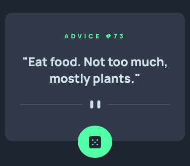
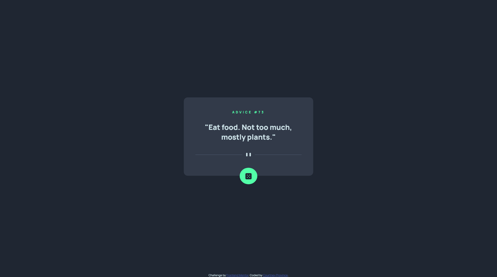

# Frontend Mentor - Advice generator app solution

This is a solution to the [Advice generator app challenge on Frontend Mentor](https://www.frontendmentor.io/challenges/advice-generator-app-QdUG-13db). Frontend Mentor challenges help you improve your coding skills by building realistic projects.

## Table of contents

- [Overview](#overview)
  - [The challenge](#the-challenge)
  - [Screenshot](#screenshot)
  - [Links](#links)
- [My process](#my-process)
  - [Built with](#built-with)
  - [What I learned](#what-i-learned)
  - [Continued development](#continued-development)
- [Author](#author)

## Overview

### The challenge

Users should be able to:

- View the optimal layout for the app depending on their device's screen size
- See hover states for all interactive elements on the page
- Generate a new piece of advice by clicking the dice icon

### Screenshot

### Links

- Solution URL: [Add solution URL here](https://your-solution-url.com)
- Live Site URL: [https://prvca.github.io/Frontend-Mentor-Challenges/advice-generator-app-main/](https://prvca.github.io/Frontend-Mentor-Challenges/advice-generator-app-main/)

## My process

### Built with

- Semantic HTML5 markup
- SCSS variables
- Flexbox
- Mobile-first workflow
- BEM

### What I learned

1. I learned how to use fetch to display data from an API.

2. I learned how to create a button that reloads the API when clicked.

### Continued development

I would like to continue learning how to use APIs. I also want to learn about event handling so I can handle any errors that may come up when dealing with APIs.

## Author

- Frontend Mentor - [@prvca](https://www.frontendmentor.io/profile/prvca)
